[← Volver al inicio](../README.md)

# Diseño de la pantalla de grabación

## Descripción general

La aplicación tiene una única pantalla principal que centraliza todas las
funcionalidades: grabar, listar, reproducir y eliminar audios. El diseño
usa una estética oscura con acentos en rojo para acciones principales y
verde para indicar reproducción activa.

## Pantalla principal en reposo

| (Diseño)                                                                                                                                          | Pantalla principal sin grabaciones                                                                                                           |
| :------------------------------------------------------------------------------------------------------------------------------------------------ | :------------------------------------------------------------------------------------------------------------------------------------------- |
| 
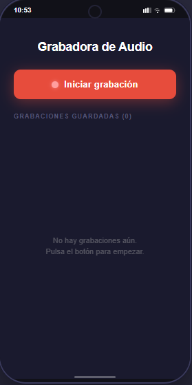
 | 
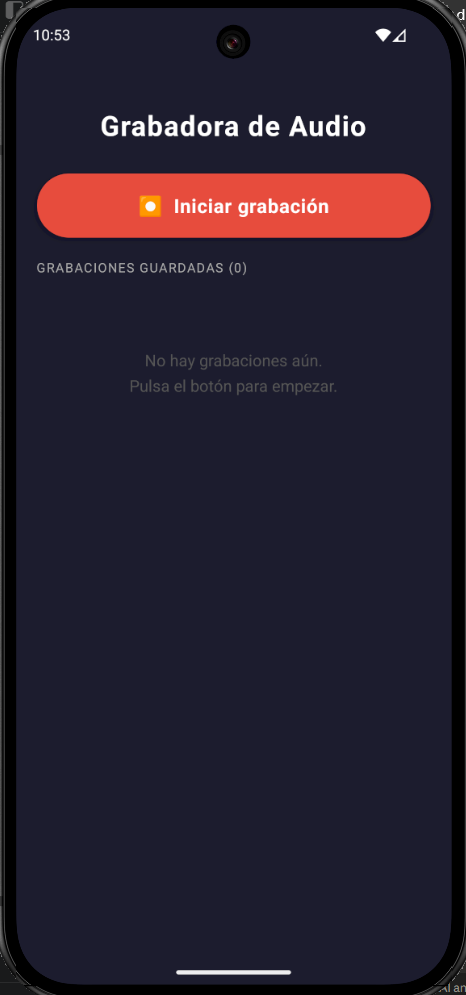
 |

### Pantalla principal con grabaciones en lista

| (Diseño)                                                                                                                                          | Pantalla principal con grabaciones                                                                                                           |
| :------------------------------------------------------------------------------------------------------------------------------------------------ | :------------------------------------------------------------------------------------------------------------------------------------------- |
| 
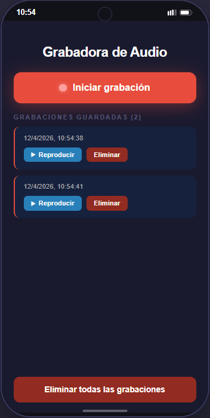
 | 
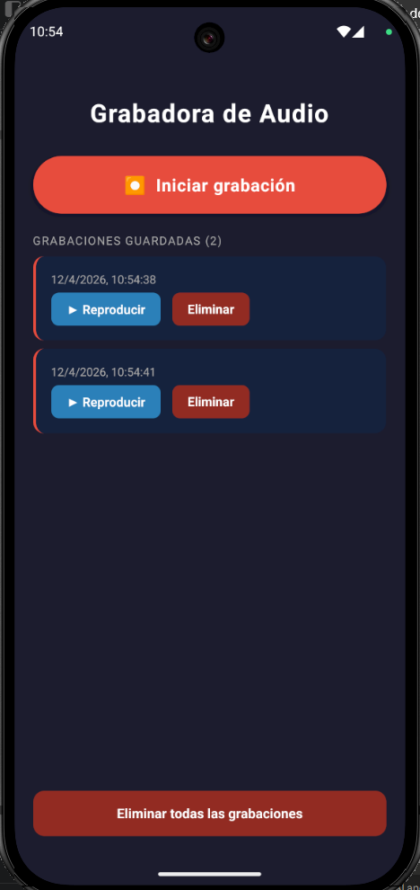
 |

## Elementos de la interfaz

### Botón de grabación (RecordButton)

Botón principal de la pantalla. Cambia de apariencia y comportamiento
según el estado de grabación.

- **Reposo:** fondo rojo, texto "Iniciar grabación"
- **Grabando:** fondo rojo oscuro, texto "Parar grabación"
- **Animación:** pulso continuo suave con escala 1 a 1.08 mientras graba,
  vuelve a escala 1 al parar

### Botón de grabación en estado "inicial" (Antes de grabar)

| (Diseño)                                                                                                                                           | Botón de grabación inicial                                                                                                                    |
| :------------------------------------------------------------------------------------------------------------------------------------------------- | :-------------------------------------------------------------------------------------------------------------------------------------------- |
| 
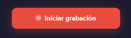
 | 
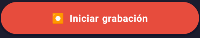
 |

### Botón de grabación en estado "activo" (Durante la grabación)

| (Diseño)                                                                                                                         | Botón de grabación activo                                                                                                   |
| :------------------------------------------------------------------------------------------------------------------------------- | :-------------------------------------------------------------------------------------------------------------------------- |
| 
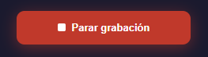
 | 
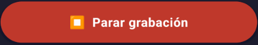
 |

### Indicador de grabación y carga (Loader)

Componente propio de animación reutilizado en dos situaciones:

- Durante la grabación activa, junto al contador de segundos transcurridos
- Durante la carga inicial de las grabaciones guardadas en AsyncStorage

Consiste en un círculo rojo que anima simultáneamente su escala (1 a 1.6)
y su opacidad (1 a 0.3) en bucle infinito.

### Loader visible durante una grabación activa

| (Diseño)                                                                                                    | Loader grabando                                                                                        |
| :---------------------------------------------------------------------------------------------------------- | :----------------------------------------------------------------------------------------------------- |
| 
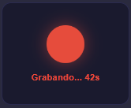
 | 
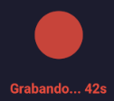
 |

### Pantalla de carga inicial (Durante la grabación)

| (Diseño)                                                                                                                                          | Pantalla inicial durante grabación                                                                                                           |
| :------------------------------------------------------------------------------------------------------------------------------------------------ | :------------------------------------------------------------------------------------------------------------------------------------------- |
| 
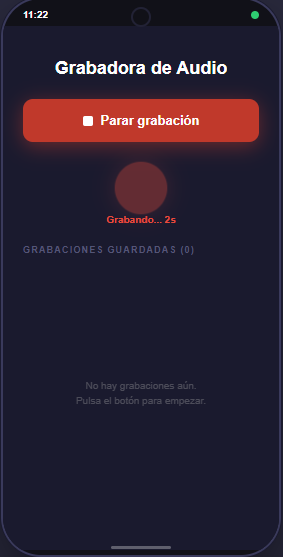
 | 
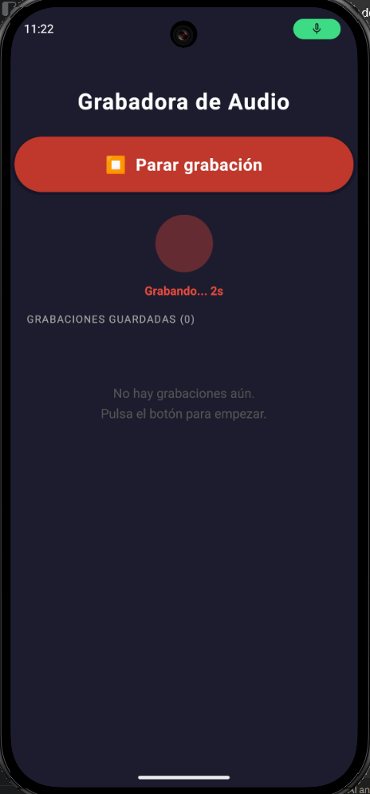
 |

### Contador de tiempo

Texto que muestra los segundos transcurridos en tiempo real mientras se
graba. Se actualiza a partir de `recorderState.durationMillis`.

### Lista de grabaciones (AudioItem)

Cada elemento de la lista muestra la siguiente información y controles:

- Fecha y hora de la grabación
- Indicador verde "Reproduciendo..." cuando está activo
- Botón "Reproducir" en azul, cambia a "Repetir" en verde cuando
  el audio se está reproduciendo
- Botón "Eliminar" en rojo oscuro
- Cuando un audio se reproduce, los demás aparecen con opacidad reducida
  y el botón de reproducir deshabilitado para evitar superposiciones

### Lista con un audio en reproducción y otros deshabilitados

| (Diseño)                                                                                                                        | Grabación reproduciéndose                                                                                                  |
| :------------------------------------------------------------------------------------------------------------------------------ | :------------------------------------------------------------------------------------------------------------------------- |
| 
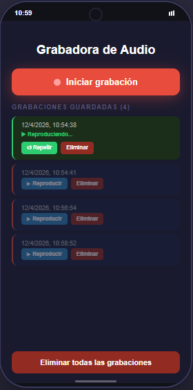
 | 
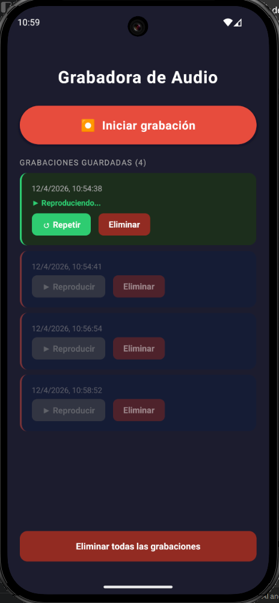
 |

### Botón eliminar todas las grabaciones

- Solo visible cuando hay al menos una grabación en la lista
- Muestra un diálogo de confirmación antes de eliminar
- Al confirmar, detiene cualquier reproducción activa y limpia la lista

### Botón eliminar todas las grabaciones

| (Diseño)                                                                                                                                              | Botón eliminar todas las grabaciones                                                                                                             |
| :---------------------------------------------------------------------------------------------------------------------------------------------------- | :----------------------------------------------------------------------------------------------------------------------------------------------- |
| 
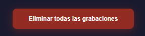
 | 
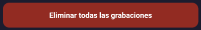
 |

### Diálogo de confirmación de eliminación

  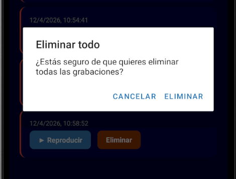

### Pantalla de permisos denegados (NoPermissionScreen)

Se muestra cuando el usuario deniega el permiso de micrófono.
Incluye dos variantes según el estado del permiso:

- Si `canAskAgain` es true: botón "Solicitar permiso" que vuelve a
  lanzar el diálogo del sistema
- Si `canAskAgain` es false: botón "Abrir ajustes" que redirige
  directamente a los ajustes del dispositivo

### Pantalla de permisos denegados con botón de solicitar

| (Diseño)                                                                                                                                                          | Pedir permisos al rechazar por primera vez                                                                                                                   |
| :---------------------------------------------------------------------------------------------------------------------------------------------------------------- | :----------------------------------------------------------------------------------------------------------------------------------------------------------- |
| 
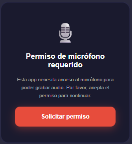
 | 
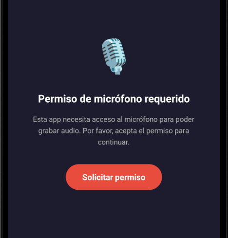
 |

### Pantalla de permisos denegados con botón de abrir ajustes

  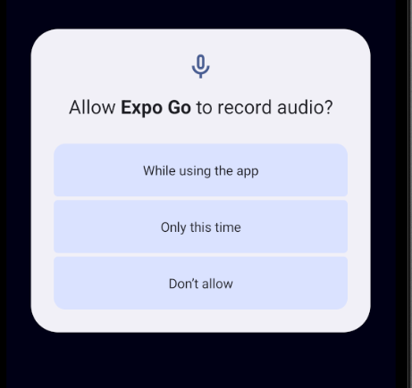

## Paleta de colores

Todos los colores están centralizados en `styles/global.ts` como tokens
reutilizables en todos los componentes.

| Token           | Valor     | Uso                                 |
| --------------- | --------- | ----------------------------------- |
| `background`    | `#1a1a2e` | Fondo principal de la app           |
| `surface`       | `#16213e` | Fondo de cada item de audio         |
| `surfaceActive` | `#1a2e1a` | Fondo de item en reproducción       |
| `primary`       | `#e74c3c` | Botón grabar, loader, borde de item |
| `primaryDark`   | `#c0392b` | Botón grabando activo               |
| `success`       | `#2ecc71` | Indicador de reproducción activa    |
| `info`          | `#2980b9` | Botón reproducir                    |
| `danger`        | `#922b21` | Botón eliminar                      |
| `disabled`      | `#555`    | Botón reproducir deshabilitado      |
| `textPrimary`   | `#ffffff` | Texto principal                     |
| `textSecondary` | `#aaa`    | Fechas y textos secundarios         |
| `textDisabled`  | `#999`    | Texto en estado deshabilitado       |

[← Volver al inicio](../README.md)
