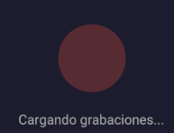

[← Volver al inicio](../README.md)

# Ejercicio 5 – Componente de carga propio

## Enunciado

> Crea un componente propio para mostrar durante los procesos de carga. Puede ser un spinner o alguna animación hecha por ti. Implementa este componente en los dos lugares de carga importante de la aplicación: al cargar las grabaciones iniciales y durante el proceso de grabación.

---

## Componente `Loader`

El componente `Loader` es una animación de pulso hecha con la `Animated API` de React Native. Consiste en un círculo rojo que anima simultáneamente su **escala** (1 → 1.6) y su **opacidad** (1 → 0.3) en bucle infinito, creando el efecto de latido.

```typescript
import React, { useEffect, useRef } from "react";
import { Animated, Easing, StyleSheet, View } from "react-native";
import { colors, spacing } from "../styles/global";

export default function Loader(): React.JSX.Element {
  const scale = useRef(new Animated.Value(1)).current;
  const opacity = useRef(new Animated.Value(1)).current;

  useEffect(() => {
    Animated.loop(
      Animated.parallel([
        Animated.sequence([
          Animated.timing(scale, {
            toValue: 1.6,
            duration: 600,
            easing: Easing.inOut(Easing.ease),
            useNativeDriver: true,
          }),
          Animated.timing(scale, {
            toValue: 1,
            duration: 600,
            easing: Easing.inOut(Easing.ease),
            useNativeDriver: true,
          }),
        ]),
        Animated.sequence([
          Animated.timing(opacity, {
            toValue: 0.3,
            duration: 600,
            easing: Easing.inOut(Easing.ease),
            useNativeDriver: true,
          }),
          Animated.timing(opacity, {
            toValue: 1,
            duration: 600,
            easing: Easing.inOut(Easing.ease),
            useNativeDriver: true,
          }),
        ]),
      ]),
    ).start();
  }, []);

  return (
    <View style={styles.container}>
      <Animated.View
        style={[styles.circle, { transform: [{ scale }], opacity }]}
      />
    </View>
  );
}

const styles = StyleSheet.create({
  container: {
    alignItems: "center",
    justifyContent: "center",
    padding: spacing.xl,
  },
  circle: {
    width: 44,
    height: 44,
    borderRadius: 22,
    backgroundColor: colors.primary,
  },
});
```

**Detalles técnicos:**

- Los dos valores animados (`scale` y `opacity`) se crean con `useRef` para que no se reinicien en cada render.
- `Animated.parallel` ejecuta los dos `Animated.sequence` (escala y opacidad) de forma simultánea.
- Cada secuencia alterna entre el valor máximo y mínimo con `Animated.timing`, usando `Easing.inOut(Easing.ease)` para que la transición sea suave.
- `Animated.loop` repite el ciclo indefinidamente.
- `useNativeDriver: true` delega la animación al hilo nativo para mejor rendimiento.

---

## Lugar 1 – Carga inicial de grabaciones

Al arrancar la app, mientras `useAudioRecording` recupera los datos de `AsyncStorage`, el estado `loading` es `true`. En ese momento `App.tsx` renderiza el `Loader` con el texto "Cargando grabaciones...":

```typescript
if (loading || permissionGranted === null) {
  return (
    <SafeAreaView style={styles.centered}>
      <Loader />
      <Text style={styles.loadingText}>
        {loading ? "Cargando grabaciones..." : "Solicitando permisos..."}
      </Text>
    </SafeAreaView>
  );
}
```

El flag `loading` pasa a `false` solo cuando `loadAudios()` termina de recuperar los datos:

```typescript
const loadAudios = async (): Promise<void> => {
  const saved = await storageService.getAudios();
  setAudios(saved);
  setLoading(false); // ← aquí desaparece el Loader
};
```

|                                      Loader cargando grabaciones                                      |
| :---------------------------------------------------------------------------------------------------: |
|  |

---

## Lugar 2 – Durante la grabación activa

Mientras `isRecording` es `true`, se muestra el `Loader` junto al contador de segundos transcurridos en tiempo real:

```typescript
{isRecording && (
  <View style={styles.recordingIndicator}>
    <Loader />
    <Text style={styles.recordingText}>
      Grabando... {Math.round(durationMillis / 1000)}s
    </Text>
  </View>
)}
```

|                           Loader durante grabación                            |                                     Pantalla completa durante grabación                                     |
| :---------------------------------------------------------------------------: | :---------------------------------------------------------------------------------------------------------: |
|  |  |

---

[← Volver al inicio](../README.md)
